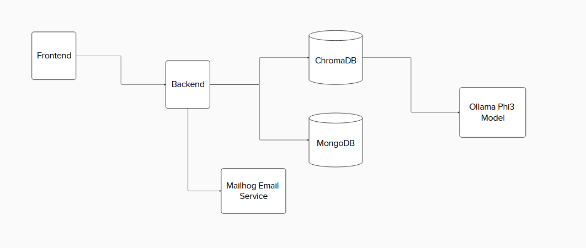

# Transcript Q&A

This is an application designed for computer science students at Stony Brook University. It allows students to upload a PDF of their transcript. Students will then
be able to ask questions about their transcript and an LLM agent will respond to such queries. 

# Installation Requirements 

- Docker Desktop
- Docker & Docker Compose
- Make

# Running Program With Docker

Follow these instructions to run the program with Docker

```
docker-compose up
```

Once the containers are running, you can then visit this URL

```
http://localhost:5173
```

# Running Program With Make 

Follow these instructions to run the program with Make 

```
make dir
```

This will run three docker commands. Once the commands are done executing, you can then visit the same URL

```
http://localhost:5173
```

# System Architecture





# Disclaimer 

Although this application was a research project and petitioned to the Stony Brook Computer Science department, it was unclear if this was fully deployed for students to use. No feedback or notice was received 
from the department to me in regards to whether or not this application was used. No confirmation was also given by the professor about this application being deployed. 
However, this application still works as intended and it is strictly for students to upload their transcrips to ask questions about it. 